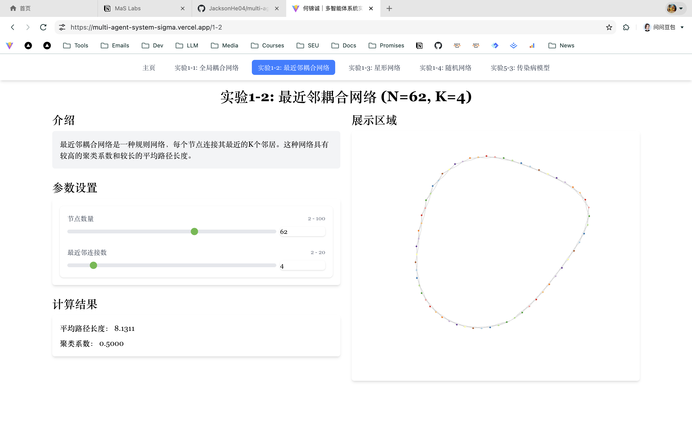

# 实验1.2：最近邻耦合网络

## 实验目的
- 实现最近邻耦合网络的生成和可视化
- 理解规则网络的结构特征
- 掌握网络拓扑特性的计算方法
- 分析最近邻耦合网络的特性

## 实验内容
### 1. 实验要求
- 实现最近邻耦合网络的生成算法
- 支持动态调整节点数量和连接数
- 展示网络的可视化图形
- 计算并展示网络的平均路径长度和聚类系数

### 2. 实验设计
#### 2.1 整体架构
- 前端使用React + TypeScript开发
- 采用组件化设计，将网络生成、计算和显示分离
- 使用Force-Directed Graph进行网络可视化
- 主要模块包括：
  - 网络生成模块
  - 网络计算模块
  - 可视化显示模块
  - 参数控制模块

#### 2.2 核心算法
- 最近邻耦合网络生成算法：
  - 创建n个节点
  - 对每个节点，连接其最近的k/2个左侧邻居和k/2个右侧邻居
  - 使用模运算处理环形结构
  - 时间复杂度：O(nk)，其中n为节点数量，k为连接数

#### 2.3 数据结构
- 网络数据结构：
  ```typescript
  interface NetworkData {
    nodes: Node[];
    links: Link[];
  }
  
  interface Node {
    id: string;
  }
  
  interface Link {
    source: string;
    target: string;
  }
  ```

### 3. 实验实现
#### 3.1 关键代码
```typescript
export function generateNearestNeighborNetwork(numNodes: number, k: number): NetworkData {
  if (k % 2 !== 0) {
    k = k - 1; // 调整为最近的偶数
  }
  if (k >= numNodes) {
    k = numNodes - 1; // 避免 k 过大导致所有节点都连接
  }

  const nodes: Node[] = [];
  for (let i = 0; i < numNodes; i++) {
    nodes.push({ id: `node${i}` });
  }

  const links: Link[] = [];
  const existingLinks = new Set<string>();

  for (let i = 0; i < numNodes; i++) {
    for (let j = 1; j <= k / 2; j++) {
      // 连接右侧邻居
      const targetRight = (i + j) % numNodes;
      let sourceId = `node${i}`;
      let targetId = `node${targetRight}`;
      let linkKey = `${sourceId}-${targetId}`;
      let reverseLinkKey = `${targetId}-${sourceId}`;

      if (!existingLinks.has(linkKey) && !existingLinks.has(reverseLinkKey)) {
        links.push({ source: sourceId, target: targetId });
        existingLinks.add(linkKey);
      }

      // 连接左侧邻居
      const targetLeft = (i - j + numNodes) % numNodes;
      sourceId = `node${i}`;
      targetId = `node${targetLeft}`;
      linkKey = `${sourceId}-${targetId}`;
      reverseLinkKey = `${targetId}-${sourceId}`;

      if (!existingLinks.has(linkKey) && !existingLinks.has(reverseLinkKey)) {
        links.push({ source: sourceId, target: targetId });
        existingLinks.add(linkKey);
      }
    }
  }

  return { nodes, links };
}
```

#### 3.2 实现细节
- 使用React Hooks管理组件状态
- 实现了参数动态调整功能
- 使用Set数据结构避免重复边
- 采用模运算处理环形结构
- 自动处理k为奇数的情况

### 4. 实验结果
#### 4.1 运行效果

- 支持2-100个节点的网络生成
- 支持2-20的最近邻连接数（k值）
- 实时显示网络拓扑图
- 动态计算并显示网络指标

#### 4.2 结果分析
- 最近邻耦合网络的特点：
  - 具有规则的环形结构
  - 聚类系数较高（局部连接紧密）
  - 平均路径长度随网络规模增长而增加
  - 具有较好的局部连通性

## 实验总结
### 1. 实验收获
- 掌握了规则网络的生成算法
- 理解了最近邻耦合网络的结构特征
- 学会了处理环形结构的技巧
- 提高了网络可视化开发能力

### 2. 改进方向
- 可以添加更多的网络参数控制
- 优化大规模网络的可视化性能
- 增加网络动态演化的功能
- 添加更多的网络分析指标

## 附录
### 部署链接
https://multi-agent-system-sigma.vercel.app/1-2
### 源代码链接
https://github.com/JacksonHe04/multi-agent-system/tree/main/src/pages/1-2
### 实验报告链接
https://jacksonhe.notion.site/mas-labs-1-2
